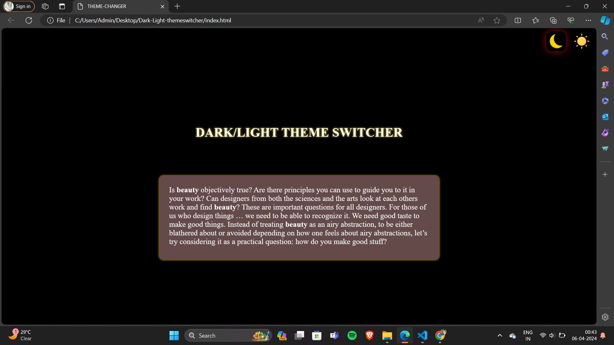
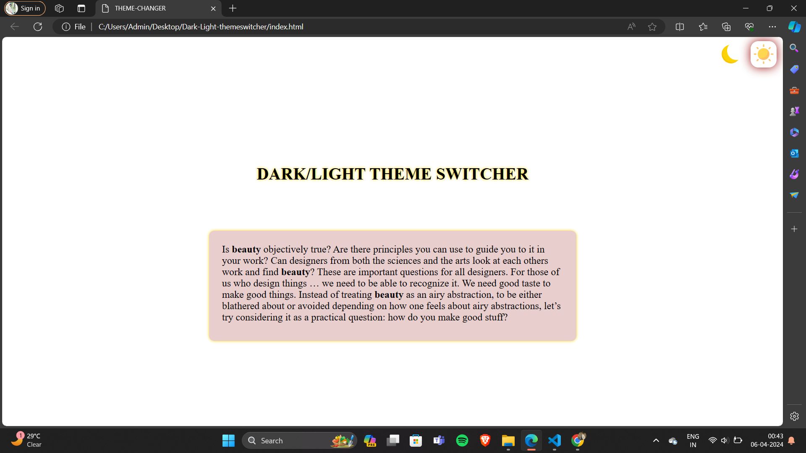

# THEME-CHANGER

**WELCOME TO THEME-CHANGER DESIGN:**
This is a `open-source` project serves as an example for THEME-CHANGE design inspired from the THEME-CHANGER applications` THEME-CHANGER-APPLICATION
` design and utilised the knowledge provided by `road to code's
course`.

whether you are an employee or a normal user this Appplication can help you to change the theme of website that is form light theme to dark theme and we can get  a basic idea about how a theme-changer is designed and how it  works.This `Theme-changer` is based on the  `light-theme` & `Dark-theme` changes.

`DARK-THEME`

`LIGHT-THEME`

## How to contribute 

We welcome contributions from the community to help us improve this project.IF you would like to contribute,follow these steps:

1.Fork the repository to your Github account 

2.Make your changes, add new content,or fix any existing issues.

3.Open a new pull request in this repository.

